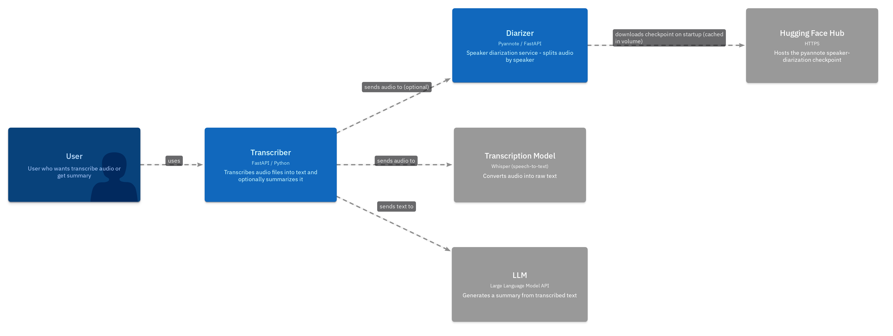
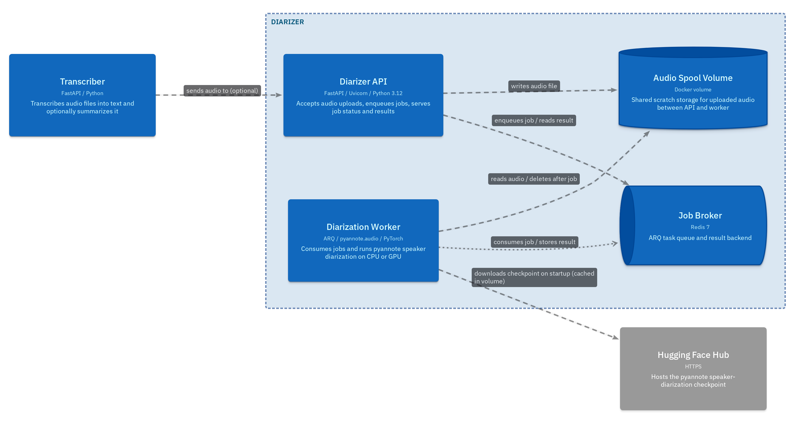
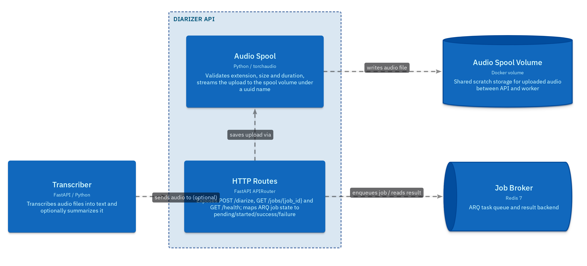
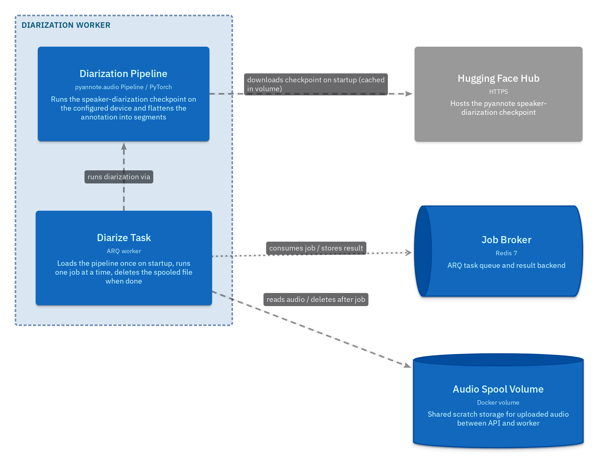
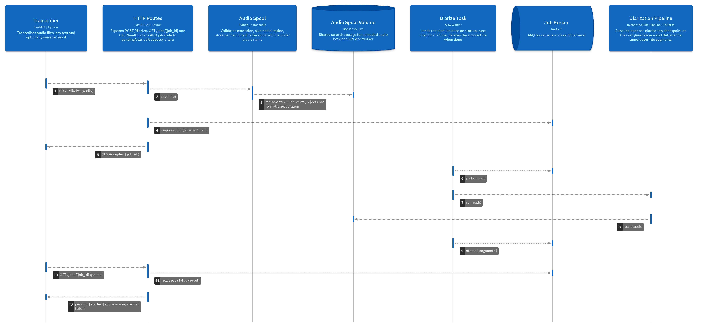

# Ai-Transcriber

<h2>Architecture</h2>

### System Context

### Containers - Diarizer

The API accepts an upload and returns. Worker consumes the job out of band. Redis carries the job and its result.

### Components - Diarizer API

### Components - Diarization Worker

### Flow - Diarize an audio file

