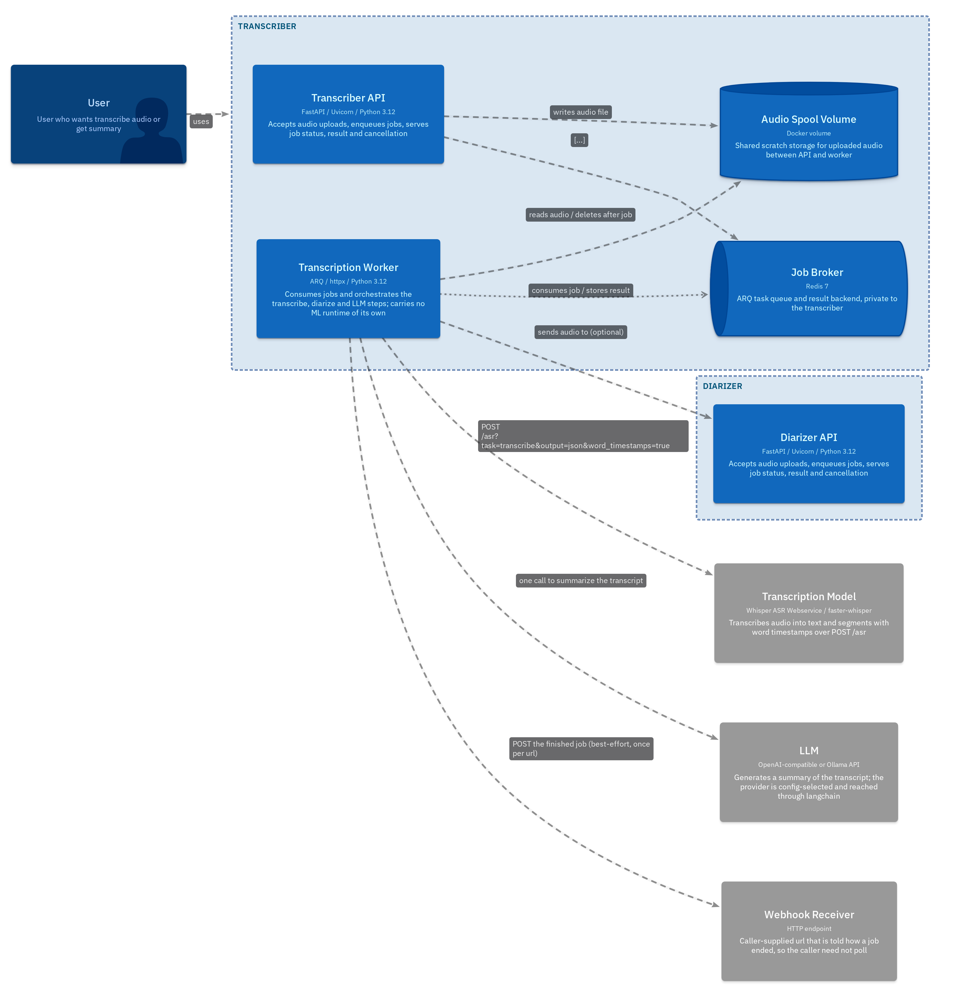
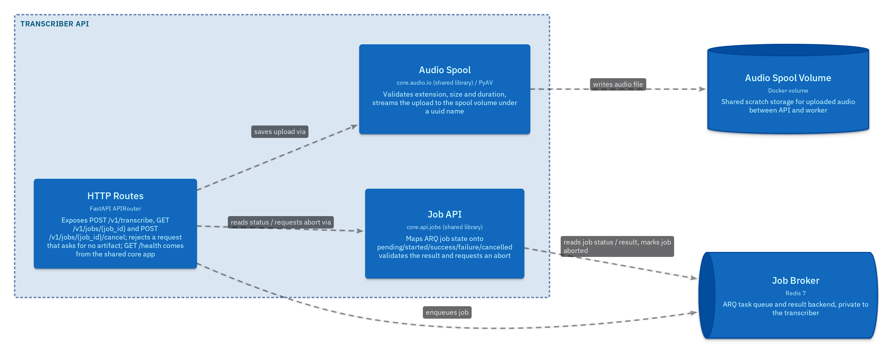
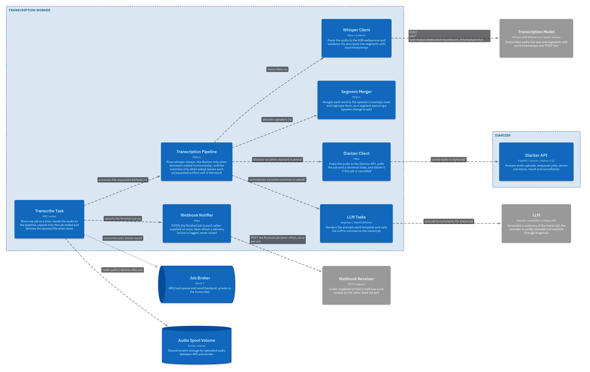
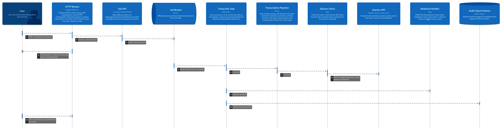

# Ai-Transcriber

Transcribe audio into a raw transcript, a speaker-diarized transcript, and an LLM summary.
The **transcriber** service orchestrates Whisper, an internal diarizer, and an LLM. It is
the only service exposed to the outside.

## Run

```bash
cp .env.example .env
docker compose up --build
```

`COMPOSE_PROFILES=cpu` (default) or `gpu` in `.env` picks the worker/Whisper variant.

Transcriber API - `http://localhost:8000` (interactive docs at `/docs`).

## API

Submit, poll, cancel.

- `POST /v1/transcribe` - form: `file`, and any of `raw`, `diarized`, `summary` (at least one), optional `webhooks[]`
- `GET  /v1/jobs/{id}` - status and result
- `POST /v1/jobs/{id}/cancel`

## MCP

`mcp-server` exposes transcription to AI agents over Streamable HTTP at
`http://localhost:8002/mcp`. One tool:

- `transcribe(path, raw, diarized, summary)` - `path` is a file in the shared pool, absolute or relative to its root; returns the requested artifacts once the job finishes.

The pool is `POOL_DIR` from `.env`, mounted read-only at the same path. Mount the directory the
agent's uploads land in there, so the paths it reports resolve inside the MCP container.

## Config

- `config.yaml` - runtime settings (models, limits, LLM provider, logging)
- `prompts.yaml` - summary prompts
- `.env` - ports, tokens, images, profile

<details>
<summary><h2>Architecture</h2></summary>

### System Context


### Containers - Diarizer

The API accepts an upload and returns. Worker consumes the job out of band. Redis carries the job and its result.


### Components - Diarizer API


### Components - Diarization Worker


### Flow - Diarize an audio file


### Containers - Transcriber



### Components - Transcriber API



### Components - Transcription Worker



### Flow - Transcribe an audio file


### Flow - Cancel a job


</details>